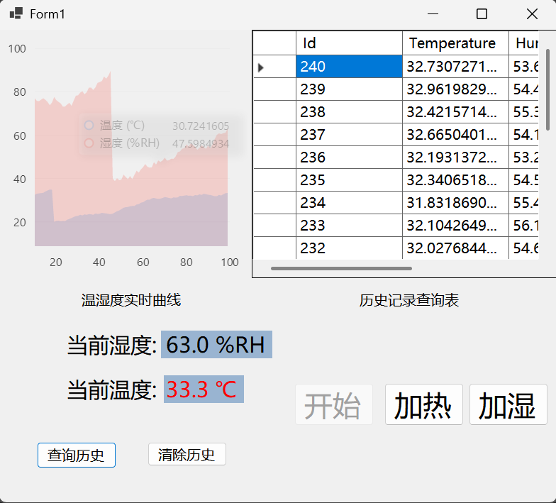

# 温湿度模拟监控与历史数据查询系统

## 项目简介
本项目是一个用 C# 编写的 Windows 桌面应用，完整模拟了工业上位机软件的核心流程：设备数据采集、实时显示、超限报警、数据存储及历史查询。

## 核心功能
- **实时监控**：每秒动态刷新温度与湿度数值，数据自动波动。
- **智能报警**：温度超过 30℃ 或湿度超过 70% 时，对应数值会变为红色预警。
- **动态趋势图**：采用 LiveCharts 2 库，实时绘制温湿度的动态变化曲线。
- **数据存储**：通过 ADO.NET 连接 SQLite 数据库，自动创建表并持久化存储所有数据。
- **历史查询**：可随时查看数据库中保存的历史记录，支持数据清空与重置。

## 技术栈
`C#` `.NET Framework` `WinForm` `SQLite` `ADO.NET` `LiveCharts 2`

## 项目运行截图

## 如何运行？
1.  使用 Visual Studio 2022 打开`.sln`解决方案文件。
2.  按 `F5` 或点击“启动”按钮即可运行。
